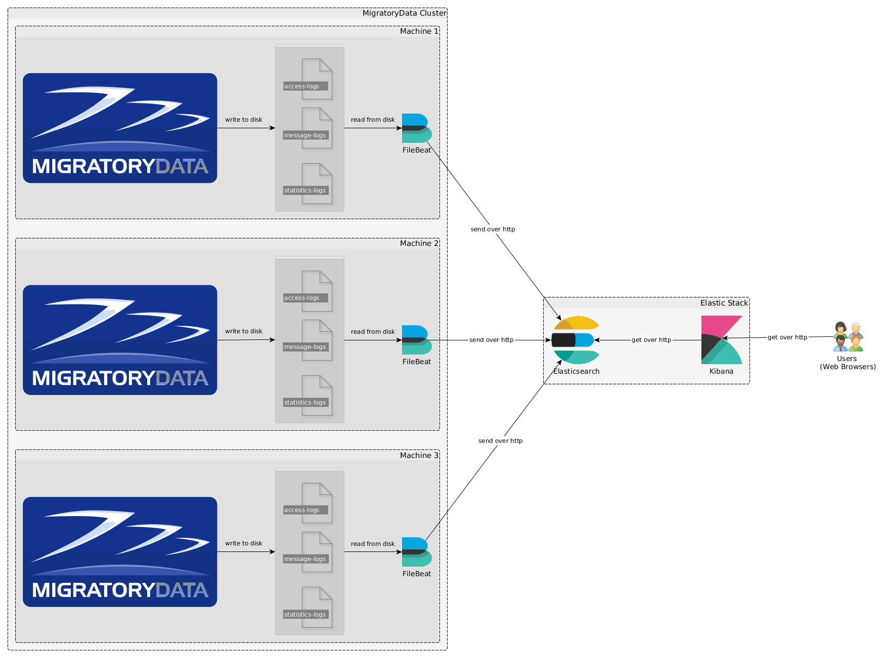
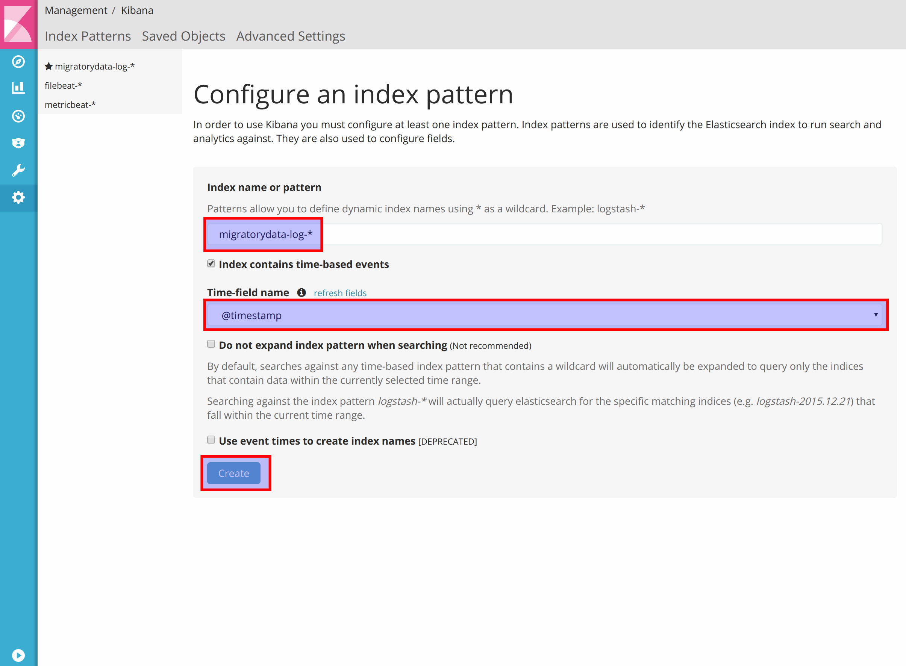
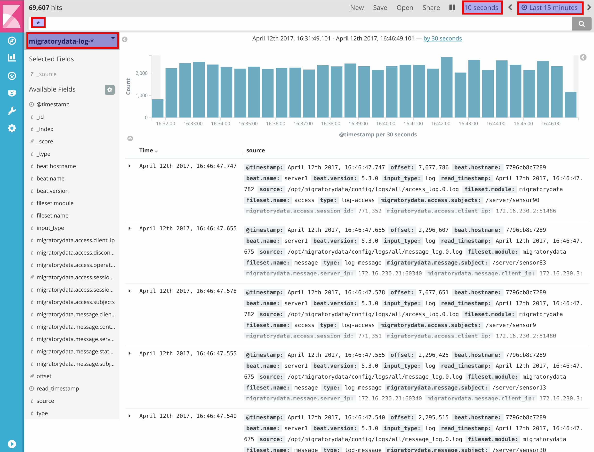
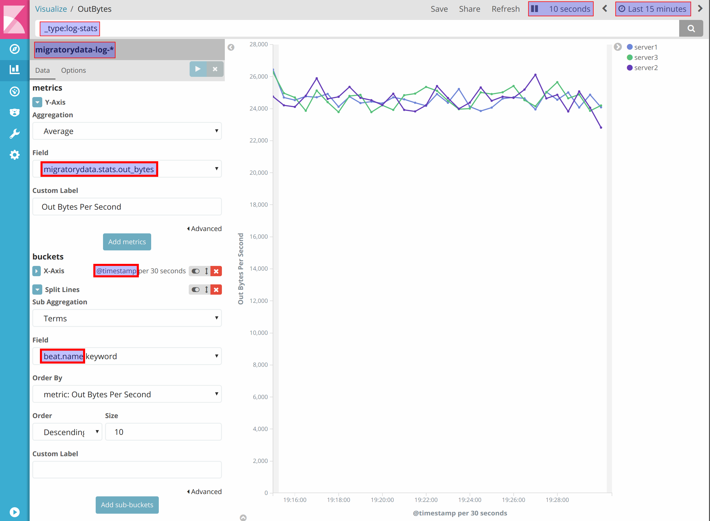
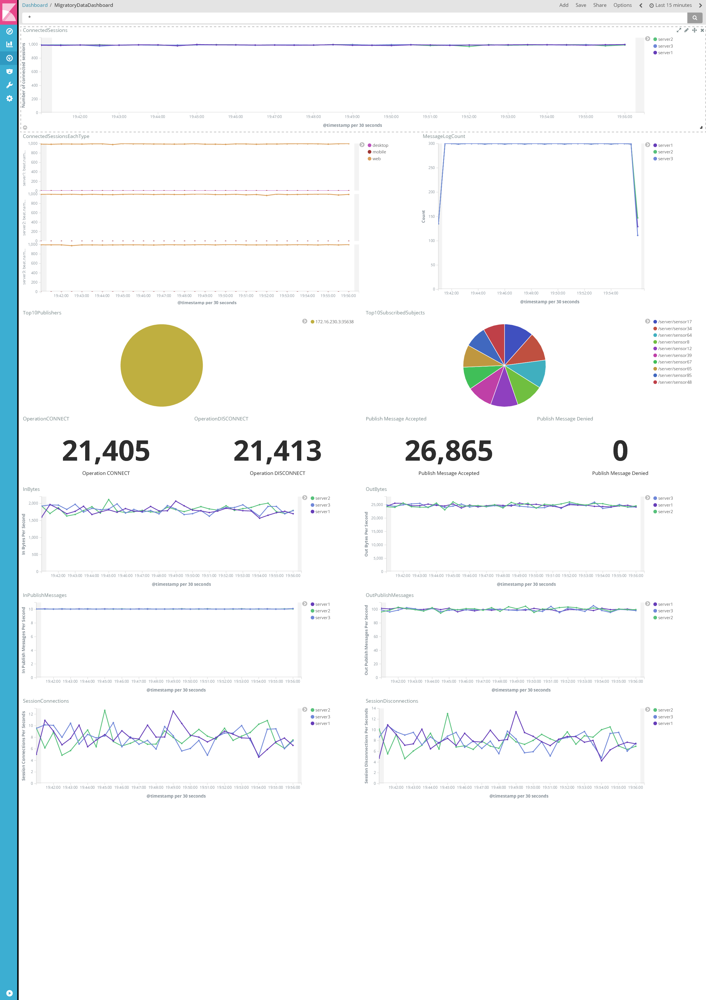
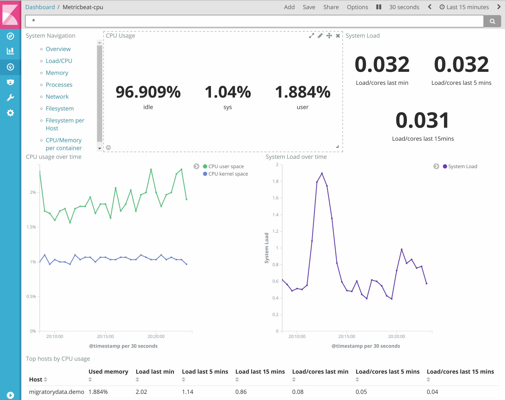

# Introducing MigratoryData to Big Data: Elastic Stack

[MigratoryData](http://migratorydata.com) is the industry's most scalable real-time messaging solution, typically used 
in large deployments with millions of users. Among its many [features](http://migratorydata.com/migratorydata-server.html), 
MigratoryData provides a number of monitoring options along the HTTP and JMX standards. Also, any of its API libraries 
can be used to subscribe to special monitoring subjects and receive real-time statistics.

These MigratoryData statistics, made available along HTTP, JMX, and PUSH monitoring, are also logged on disk (at 
configurable time intervals) and, while these logs are typically preserved for audit, they can also be used for other 
purposes such as monitoring or even debugging. For example, message logs can be used by MigratoryData Replayer - a tool 
able to replay a feed of messages, and publish recorded messages at slower, faster or original speeds by preserving the 
timestamp proportions.

It becomes obvious, then, how statistics logs, access logs, and message logs produced by such a high number of users can result in a huge 
amount of data. Hence, using a big data platform is natural.

In this blog post, we show how to use popular open-source big data platform Elastic Stack for searching, analyzing, 
and visualizing data produced by MigratoryData clusters. More precisely we will use:

* Filebeat for collecting the MigratoryData logs (access logs, message logs, and statistics)
* Elasticsearch for indexing MigratoryData logs
* Kibana for exploring, searching and filtering MigratoryData logs and for building dashboards to visualize the data

This blog post is based on Elastic Stack version 5.3.0 and MigratoryData version 5.0.21. All configuration files, 
dashboards, diagrams, and screenshots can be found on [github](https://github.com/migratorydata/migratorydata-elastic-stack).

## Setup

For the purposes of this post, our setup consists of a MigratoryData cluster of three nodes. Each node runs one instance 
of MigratoryData Server and one instance of Filebeat. Filebeat is an agent which collects access logs, message logs, and 
statistics logs produced by the MigratoryData server. These logs are collected as soon as they are produced by the 
MigratoryData server. Collected logs are then sent to Elasticsearch over the network. Finally, users connect from web 
browsers to Kibana to make queries which are automatically forwarded to Elasticsearch.



## Elasticsearch Installation and Configuration

You can start by installing one instance of Elasticsearch and one instance of Kibana on the same machine. Advanced 
Elastic Stack settings are available, including high availability clustering, but these are beyond the scope of 
this post. 

The installation of Elasticsearch on Linux requires one kernel tuning. You can apply it temporarily by 
running the following command:

```
sudo sysctl -w vm.max_map_count=262144
```

Alternatively, you can apply this kernel tuning permanently: edit the system configuration file `/etc/sysctl.conf`, add 
the following line at the end of the file, and finally restart the Linux system:

```
vm.max_map_count = 262144
```


Let us suppose that the IP address of the machine running Elasticsearch and Kibana is `192.168.1.1`. The installation of 
Elasticsearch is straightforward. Download the installation package in zip or tar format and uncompress it. Edit the 
default configuration file `elasticsearch.yml` located under the folder `config` and configure the parameter 
`network.host` as follows:

```
network.host = 192.168.1.1
```

Finally, run the startup script elasticsearch located under the folder `bin`. Elasticsearch will use the IP address 
`192.168.1.1` configured above and the default port `9200` to accept connections and communicate with both the Filebeat 
agents and Kibana.


## Kibana Installation and Configuration

Kibana installation is straightforward. Simply download the installation package in zip or tar format and uncompress it. 
Edit the default configuration file `kibana.yml` located under the folder `config` and configure the parameter 
`elasticsearch.url` as follows:

```
elasticsearch.url = 192.168.1.1:9200
```

Finally, run the startup script `kibana` located under the folder `bin`.

Kibana will use the above configuration to connect to Elasticsearch and will use the default port `5601` to accept 
connections from users.

## Filebeat Installation and Configuration

One instance of the Filebeat agent should be installed on each machine of the MigratoryData cluster. The Filebeat agent 
collects the logs produced by the MigratoryData server into the folder defined by its parameter `LogFolder`, and send 
them to Elasticsearch.

In order to install Filebeat, download the package in zip or tar format and uncompress it. Filebeat comes with a number 
of predefined modules available under the folder `module`. For example, there is a module for collecting logs of 
apache2 or nginx. A module basically defines the rules for transforming a particular logging format into a field-based 
format understood by Elasticsearch. The module based architecture of Filebeat allows us to create new modules.

We created a new module for Filebeat named `migratorydata` which defines the rules for parsing the access logs,
message logs, and statistics logs of the MigratoryData server.

In order to install the new module, copy the folder `migratorydata` available in the 
[github](https://github.com/migratorydata/migratorydata-elastic-stack) repository under the 
folder `elastic-stack/filebeat/module` into the folder `module` of your Filebeat installation.

The structure of the `migratorydata` module is as follows:

```
migratorydata
├── access
│   ├── config
│   │   └── access.yml
│   ├── ingest
│   │   └── pipeline.json
│   └── manifest.yml
├── message
│   ├── config
│   │   └── message.yml
│   ├── ingest
│   │   └── pipeline.json
│   └── manifest.yml
└── stats
    ├── config
    │   └── stats.yml
    ├── ingest
    │   └── pipeline.json
    └── manifest.yml
```

The module is structured into three similar sections corresponding to the three log types: access logs, message logs, and 
statistics. 

### Config Files

The config file of the `access` section is similar to the one of the other two sections with 
the only exception that `document_type` defines the respective type of logs:

```
input_type: log
document_type: log-access
paths:
{{ range $i, $path := .paths }}
 - {{$path}}
{{ end }}
```

For the `message` and `stats` sections, `document-type` is `message-log` and `stats-logs`, respectively.

### Manifest Files

The `manifest` files of the three sections differ only by the definition of `paths` which points to the 
corresponding log file. For example, the `manifest` of the `access` section looks like:  

```
module_version: "1.0"

var:
  - name: paths
    default:
      - /var/log/migratorydata/all/access_*

ingest_pipeline: ingest/pipeline.json
prospector: config/access.yml
```

Similarly, the `manifest` of the `message` and `stats` sections will be similar excepting the `paths` pattern which is 
`message_*` and `pushserver_*`, respectively.

### Pipeline Files

Finally, the `pipeline` file defines the parsing rules of the logs. These rules are specific for each log type. 

#### Pipeline for Access Logs
 
The `pipeline` file of the `access` section defines the rule for parsing each user connection log into an
Elasticsearch document with the following fields:

```
   @timestamp
   migratorydata.access.time
   migratorydata.access.session_id
   migratorydata.access.client_ip
   migratorydata.access.operation
   migratorydata.access.user_agent
   migratorydata.access.session_type
   migratorydata.access.entitlement_token
   migratorydata.access.subjects
```

It also defines the rule for parsing each user disconnection log into an Elasticsearch document with the following fields:

```
   @timestamp
   migratorydata.access.time
   migratorydata.access.session_id
   migratorydata.access.client_ip
   migratorydata.access.operation
   migratorydata.access.disconnect_status
   migratorydata.access.subjects
```

#### Pipeline for Message Logs

The `pipeline` file of the `message` section defines the rule for parsing each MigratoryData message into an Elasticsearch
document with the following fields:

```
   @timestamp
   migratorydata.message.time
   migratorydata.message.subject
   migratorydata.message.content
   migratorydata.message.fields
   migratorydata.message.client_ip
   migratorydata.message.server_ip
   migratorydata.message.status
```

#### Pipeline for Statistics

The `pipeline` file of the `stats` section defines the rule for parsing the statistics logged every 60 seconds 
(configurable with the parameter `Stats.LogInterval`)  into Elasticsearch documents with the following fields:

```
   @timestamp
   migratorydata.stats.time
   migratorydata.stats.connected_sessions
   migratorydata.stats.connected_sessions_web
   migratorydata.stats.connected_sessions_mobile
   migratorydata.stats.connected_sessions_desktop
   migratorydata.stats.session_connections
   migratorydata.stats.session_disconnections
   migratorydata.stats.in_publish_msg
   migratorydata.stats.out_publish_msg
   migratorydata.stats.in_bytes
   migratorydata.stats.out_bytes
```

### Running Filebeat

At this stage, the `migratorydata` module has been installed into the folder `module` as detailed above. To run Filebeat,
a configuration file `migratorydata.yml` should be created into the root of the Filebeat installation as follows:
 
```
output.elasticsearch:
    hosts: ["192.168.1.1:9200"]
    index: "migratorydata-log-%{+yyyy.MM.dd}"
```

This file is also available under the [github](https://github.com/migratorydata/migratorydata-elastic-stack) repository. 
This file specifies the address of Elasticsearch as well as the name of the Elasticsearch index used to group all the 
documents corresponding to the MigratoryData logs received from the Filebeat agents.

Finally, to run the Filebeat agent for the MigratoryData server of the cluster named, for example, `server1` use the following command:

```
./filebeat -c migratorydata.yml -modules=migratorydata -E name=sever1 -e
```

Please note that the `-E name=server1` part of the above command is optional. If not provided, Filebeat will use the 
hostname of the machine running that instance of the MigratoryData server. Using such assignation is particularly useful 
for testing when all servers of the MigratoryData cluster run on the same machine. Indeed, in order to be able to monitor 
each instance of the MigratoryData server of the cluster individually, each Filebeat agent will add a built-in 
field `beat.name` containing the value provided by the `name` attribute above to each log that it sends to Elasticsearch.

## Using Kibana

In the example above, Kibana has been configured to listen for users on the IP address `192.168.1.1` and port `5601`. 
Therefore, in order to access Kibana, use a modern web browser such as Google Chrome and open the following location:

```
http://192.168.1.1:5601
```

### Creating a MigratoryData Index

The first time you access Kibana, it will ask you to create an index. An index is used to group together all related 
Elasticsearch documents. In this case, we will group the documents corresponding to the MigratoryData logs collected by 
the Filebeat agents from the MigratoryData cluster under an index pattern `migratorydata-log-*`. To create the index, 
Kibana will propose a form such as the one below:



Once the index has been created, you can see it by navigating to `Management` -> `Index Patterns`.

### Exploring

To explore **all data** received from the MigratoryData cluster, navigate to `Discover`, type `*` in the query box, and select the 
migratorydata index pattern `migratorydata-log-*`. In the top menu on the right, you have a time picker where you can 
select for example `Last 15 minutes` and  can also define `Auto-refresh` to a configurable amount of time, say 
`10 seconds`, to see the data received continuously during the moving window of last 15 minutes. You can also use the time 
peaker to explore any desired time interval including a given number of seconds, minutes, hours, days, or years ago. Finally, 
you can also explore the data between two absolute dates.



The histogram in the screenshot above shows the number of MigratoryData logs indexed every 30 seconds during the 
selected time period. The table below the histogram lists Elasticsearch documents, structured by fields, corresponding 
to the MigratoryData logs which occurred during the selected time period. The left hand side displays the field names, 
which correspond to the fields defined by parsing rules of the Filebeat agents as explained above, together with a number 
of built-in fields introduced by Filebeat (above we already discussed the built-in field `beat.name`).

### Searching / Filtering

You can refine your exploration of the data in the previous section by entering a search criterion in the query box. You can 
perform a free text search or also search data by field. For example, to get all the logs of users which 
connect from IP address `172.16.230.4`, you can perform a a search such as `migratorydata.access.client_ip:172.16.230.4`. Below is
a more complex search using boolean operators. Note that the boolean operators `AND`, `OR`, and `NOT` are case sensitive. For
more details, please refer to Kibana documentation.


A search filter can be saved and used for a later search. In this example the search filter has been saved under
the name `search-connections-by-ip-during-timeinterval` as highlighted in the screenshot above. The saved search filter 
can be also used to build visualizations for the filtered data (as shown in the next section). 

It is worth mentioning that the time picker of a search form can be used, for example, to define an `Auto refresh` time 
such that new search results can be displayed as long as new data are added to Elasticsearch which match the search criterion.

### Visualizing 

As an example, we visualized the outgoing bytes per second during the last 15 minutes. We filtered stats logs using 
the search criterion `_type:log-stats`, defined the Y axis based on the field `migratorydata.stats.out_bytes`, grouped 
values in buckets of 30 seconds time periods according to the X axis defined by `@timestamp`, and finally displayed the 
bucket's average of the outgoing bytes per second for each MigratoryData server of the cluster. We also split the lines 
by the field `beat.name` discussed above, which help to distinguish among the data coming from each cluster member.



In the screenshot above we defined `Auto refresh` at `10 seconds` and therefore the chart is updating continuously every
10 seconds.

Visualizations can be saved and are typically used in building dashboards as we will be showing in the next section.


### Dashboard Monitoring

Multiple visualizations can be grouped together into a dashboard, and can be easily rearranged. The screenshot below 
provides one such example, with the the name of each visualization visible on the dashboard.



As for all other Kibana elements, an `Auto refresh` time can be defined, such that monitoring is performed continuously. 
The time picker can be used to monitor various time periods including historical time intervals.

This dashboard template is also available in the [github](https://github.com/migratorydata/migratorydata-elastic-stack) repository. 
In order to load it, navigate to `Management` -> `Saved Objects` -> `Import`.

## Further Monitoring

Using the few concepts presented above you can build various filtering, visualizations, and dashboards according to your needs. 
Moreover, you can simply build new modules to index additional information into Elasticsearch. Last but not least, 
Elasticsearch has integrations with various applications and therefore you can use it to monitor other environments 
alongside MigratoryData clusters in a single place. 

 
### System Monitoring: Metricbeat

Besides the Filebeat agent, Elasic Stack provides Metricbeat, an off-the-shelf agent which collects various system 
information. This allows you to monitor each machine of the MigratoryData cluster in (near) real-time and also see 
historical metrics. Metricbeat comes with predefined dashboards which you can load as explained above. Metricbeat 
should be installed alongside Filebeat on each machine of the MigratoryData cluster. Here is an example of a dashboard 
produced with Metricbeat.



### Garbage Collections (GC) Logs

In the future we will enhance the Filebeat module `migratorydata`  to also parse the GC logs produced by the Java Virtual 
Machine (JVM) running the MigratoryData server.

### New Suggestions

What are your thoughts on the above? We welcome all suggestions and would love to enhance monitoring with any additional 
information and dashboards, at your request. Just let us know!

Finally, for more information on MigratoryData Server, and for a comprehensive list of product features please visit 
[migratorydata.com](http://migratorydata.com). 
