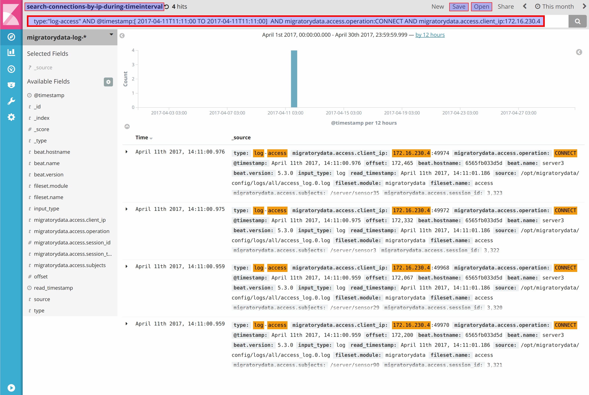

# Introducing MigratoryData to Big Data: Elastic Stack

MigratoryData provides a number of monitoring options along the HTTP and JMX standards. In addition, any MigratoryData API 
library can be used to subscribe to special monitoring subjects to receive various MigratoryData statistics in real-time. 
MigratoryData also provides different log types including access logs and message logs. Various MigratoryData statistics, 
made available along HTTP, JMX, and PUSH monitoring, are also logged on disk (at configurable time intervals).

These logs are typically preserved for audit. However, they can be used for other purposes such as monitoring or even 
debugging. For example, the message logs can be used by MigratoryData Replayer, a tool able to replay a feed of 
messages (it is able to publish the recorded messages at the same speed as they occurred, accelerate or slow down the 
original speed by preserving the timestamps proportions, etc).

As a very scalable messaging solution, MigratoryData is typically used in large deployments with millions of users. In this 
way, the access logs and message logs produced by such high number of users consist in huge amounts of data. Hence, using 
a big data platform is natural.

In this blog post, we show how to use the popular open-source big data platform Elastic Stack for searching, analyzing, and 
visualizing data produced by MigratoryData clusters. More precisely we will use:

* Filebeat for collecting the MigratoryData logs (access logs, message logs, and statistics)
* Elasticsearch for indexing the MigratoryData logs
* Kibana for exploring, searching and filtering the MigratoryData logs and for building dashboards to visualize the data

This blog post is based on Elastic Stack version 5.3.0 and MigratoryData version 5.0.21. All configuration files, dashboards, 
diagrams, and screenshots can be found on [github](https://github.com/migratorydata/migratorydata-elastic-stack).

## Setup

For current purposes our setup consists in a MigratoryData cluster of three nodes. Each node runs one instance 
of MigratoryData Server and one instance of Filebeat. Filebeat is an agent which collects access logs, message logs, and 
statistics logs produced by the MigratoryData server. The logs are collected on the fly, as soon as they are produced by 
the MigratoryData server. The collected logs are sent to Elasticsearch over the network. Finally, users connect from web 
browsers to Kibana to make queries that are automatically forwarded to Elasticsearch. 


## Elasticsearch Installation and Configuration

You can start by installing one instance of Elasticsearch and one instance of Kibana on the **same machine**. Advanced 
Elastic Stack settings are available, including high availability clustering, but these are beyond the scope of this 
blog post.

The installation of Elasticsearch on Linux requires one kernel tuning. You can apply it temporarily by running the 
following command:

```
sudo sysctl -w vm.max_map_count=262144
```

Alternatively, you can apply this kernel tuning permanently. To this end, edit the system configuration file 
`/etc/sysctl.conf`, add the following line at the end of the file, and finally restart the Linux system:

```
vm.max_map_count = 262144
```

Let us suppose that the IP address of the machine running Elasticsearch and Kibana is `192.168.1.1`.

The installation of Elasticsearch is straightforward. Download the installation package in zip or tar format and 
uncompress it. Edit the default configuration file `elasticsearch.yml` located under the folder `config` and configure 
the parameter `network.host` as follows:

```
network.host = 192.168.1.1
```

Finally, run the startup script `elasticsearch` located under the folder `bin`.

Elasticsearch will use the IP address `192.168.1.1` configured above and the default port `9200` to accept connections and
communicate with both the Filebeat agents and Kibana.

## Kibana Installation and Configuration

The installation of Kibana is straightforward. Simply download the installation package in zip or tar format and 
uncompress it. Edit the default configuration file `kibana.yml` located under the folder `config` and configure the
parameter `elasticsearch.url` as follows:

```
elasticsearch.url = 192.168.1.1:9200
```

Finally, run the startup script `kibana` located under the folder `bin`. 

Kibana will use the above configuration to connect to Elasticsearch and will use the default port `5601` to accept 
connections from users.

## Filebeat Installation and Configuration

One instance of the Filebeat agent should be installed on each machine of the MigratoryData cluster. The Filebeat agent 
collects the logs produced by the MigratoryData server into the folder defined by its parameter `LogFolder`, and send 
them to Elasticsearch.

In order to install Filebeat, download the package in zip or tar format and uncompress it. Filebeat comes with a number 
of predefined modules available under the folder `module`. For example, there is a module for collecting the logs of 
apache2 or nginx. A module basically defines the rules for transforming a particular logging format into a field-based 
format understood by Elasticsearch. The module based architecture of Filebeat allows us to create new modules.

We created a new module for Filebeat named `migratorydata`. It basically defines the rules for parsing the access logs,
message logs, and statistics logs of the MigratoryData server.

In order to install the new module, copy the folder `migratorydata` available in the 
[github](https://github.com/migratorydata/migratorydata-elastic-stack) repository under the folder
`elastic-stack/filebeat/module` into the folder `module` of your Filebeat installation.

The structure of the `migratorydata` module is as follows:

```
migratorydata
├── access
│   ├── config
│   │   └── access.yml
│   ├── ingest
│   │   └── pipeline.json
│   └── manifest.yml
├── message
│   ├── config
│   │   └── message.yml
│   ├── ingest
│   │   └── pipeline.json
│   └── manifest.yml
└── stats
    ├── config
    │   └── stats.yml
    ├── ingest
    │   └── pipeline.json
    └── manifest.yml
```

The module is structured into three similar sections corresponding to the three log types: access logs, message logs, and 
statistics. 

### Config Files

For example, the config file of the `access` section is similar to the one of the other two sections with 
the only exception that `document_type` defines the respective type of logs:

```
input_type: log
document_type: log-access
paths:
{{ range $i, $path := .paths }}
 - {{$path}}
{{ end }}
```

For the `message` and `stats` sections, `document-type` is `message-log` and `stats-logs`, respectively.

### Manifest Files

The `manifest` files of the three sections differ only by the definition of `paths` which points to the 
corresponding log file. For example, the `manifest` of the `access` section looks like:  

```
module_version: "1.0"

var:
  - name: paths
    default:
      - /var/log/migratorydata/all/access_*

ingest_pipeline: ingest/pipeline.json
prospector: config/access.yml
```

Similarly, the `manifest` of the `message` and `stats` sections will be similar excepting the `paths` pattern which is 
`message_*` and `pushserver_*`, respectively.

### Pipeline Files

Finally, the `pipeline` file defines the parsing rules of the logs. These rules are specific for each log type. 

#### Pipeline for Access Logs
 
The `pipeline` file of the `access` section defines the rule for parsing each user connection log into an
Elasticsearch document with the following fields:

```
   @timestamp
   migratorydata.access.time
   migratorydata.access.session_id
   migratorydata.access.client_ip
   migratorydata.access.operation
   migratorydata.access.user_agent
   migratorydata.access.session_type
   migratorydata.access.entitlement_token
   migratorydata.access.subjects
```

Also, it defines the rule for parsing each user disconnection log into an Elasticsearch documebt with the following fields:

```
   @timestamp
   migratorydata.access.time
   migratorydata.access.session_id
   migratorydata.access.client_ip
   migratorydata.access.operation
   migratorydata.access.disconnect_status
   migratorydata.access.subjects
```

#### Pipeline for Message Logs

The `pipeline` file of the `message` section defines the rule for parsing each MigratoryData message into an Elasticsearch
document with the following fields:

```
   @timestamp
   migratorydata.message.time
   migratorydata.message.subject
   migratorydata.message.content
   migratorydata.message.fields
   migratorydata.message.client_ip
   migratorydata.message.server_ip
   migratorydata.message.status
```

#### Pipeline for Statistics

The `pipeline` file of the `stats` section defines the rule for parsing the statistics logged every 60 seconds 
(configurable with the parameter `LogStatsInterval`)  into Elasticsearch documents with the following fields:

```
   @timestamp
   migratorydata.stats.time
   migratorydata.stats.connected_sessions
   migratorydata.stats.connected_sessions_web
   migratorydata.stats.connected_sessions_mobile
   migratorydata.stats.connected_sessions_desktop
   migratorydata.stats.session_connections
   migratorydata.stats.session_disconnections
   migratorydata.stats.in_publish_msg
   migratorydata.stats.out_publish_msg
   migratorydata.stats.in_bytes
   migratorydata.stats.out_bytes
```

### Running Filebeat

At this stage, the `migratorydata` module has been installed into the folder `module` as detailed above. To run Filebeat,
a configuration file `migratorydata.yml` should be created into the root of the Filebeat installation as follows:
 
```
output.elasticsearch:
    hosts: ["192.168.1.1:9200"]
    index: "migratorydata-log-%{+yyyy.MM.dd}"
```

This file is also available under the [github](https://github.com/migratorydata/migratorydata-elastic-stack) repository. 
This file specifies the address of Elasticsearch as well as the name of the Elasticsearch index used to group all the 
documents corresponding to the MigratoryData logs received from the Filebeat agents.

Finally, to run the Filebeat agent for the MigratoryData server of the cluster named say `server1` use the following command:

```
./filebeat -c migratorydata.yml -modules=migratorydata -E name=sever1 -e
```

Please note that the part of the above command `-E name=server1` is optional. If not provided, filebeat will use the 
hostname of the machine running that instance of the MigratoryData server. Using such assignation is particularly useful 
for testing when all servers of the MigratoryData cluster run on the same machine. Indeed, in order to be able to monitor 
each instance of the MigratoryData server of the cluster individually, each Filebeat agent will add to each log that it 
sends to Elasticsearch a built-in field `beat.name` containing the value provided by the `name` attribute above.

## Using Kibana

Kibana has been configured in the example above to listen for users on the IP address `192.168.1.1` and port `5601`. 
Therefore, in order to access Kibana, use a modern web browser such as Google Chrome and open the following location:

```
http://192.168.1.1:5601
```

### Creating a MigratoryData Index

The first time you access Kibana, it will ask you to create an index. An index is used to group together all related 
Elasticsearch documents. In this case, we will group the documents corresponding to the MigratoryData logs collected by 
the Filebeat agents from the MigratoryData cluster under an index pattern `migratorydata-log-*`. Kibana will propose you 
a form as follows to create the index:


Once the index has been created, you can see it by navigating to `Management` -> `Index Patterns`.

### Exploring

To explore **all data** received from the MigratoryData cluster, navigate to `Discover`, type `*` in the query box, select the 
migratorydata index pattern `migratorydata-log-*`. In the top menu on the right, you have a time picker where you can 
select for example `Last 15 minutes` and also you can define `Auto-refresh` to a configurable amount of time say 
`10 seconds` to see the data received continuously during the moving window of last 15 minutes. You can also use the time 
peaker to explore any desired time interval including a given number of seconds, minutes, hours, days, or years ago. Also, 
you can explore the data between two absolute dates.


In the above screenshot you can see a histogram showing the number of MigratoryData logs indexed every 30 seconds during
the selected time period. Below the histogram is a table with the Elasticsearch documents, structured by fields, corresponding to the 
MigratoryData logs occurred during the selected time period. The field names are shown on the left side and they correspond to the 
fields defined by the parsing rules of the Filebeat agents as explained above, together with a number of built-in fields 
introduced by Filebeat (we already discussed above the built-in field `beat.name`).

### Searching / Filtering

You can refine the exploring of data of the previous section by entering a search criterion in the query box. You can 
perform a free text search. You can also search data by field. For example, to get all the logs of the users which 
connect from the IP address `172.16.230.4`, use a search like `migratorydata.access.client_ip:172.16.230.4`. Below is
a more complex search using boolean operators. Note that the boolean operators `AND`, `OR`, and `NOT` are case sensitive. 
Anyway, please refer to Kibana documentation for full details about searching.



A search filter can be saved and used later for subsequent searches. In this example the search filter has been saved under
the name `search-connections-by-ip-during-timeinterval` as it is highlighted in the screenshot above. The saved search filter 
can be also used to build visualizations for the filtered data (as shown in the next section). 

It is worth mentioning that the time picker of a search form can be used for example to define an `Auto refresh` time 
such that new search results could be displayed as long as new data are added to Elasticsearch that match the search criterion.

### Visualizing 

For example, to visualize the outgoing bytes per second during the last 15 minutes we filter stats logs using the search criterion 
`_type:log-stats`, define the Y axis based of the field `migratorydata.stats.out_bytes`, group values in buckets 
corresponding to period of time of 30 seconds according to the X axis defined by `@timestamp`, and finally display the bucket's average of
the outgoing bytes per second for each MigratoryData server of the cluster as we split the lines by the field `beat.name`
that we discussed above and that distinguishes among the data coming from each cluster member.


In the screenshot above we defined `Auto refresh` at `10 seconds` and therefore the chart is updating continously every
10 seconds.

Visualizations can be saved and typically used in building dashboards as we are going to show in the next section.


### Dashboard Monitoring

Multiple visualizations can be grouped together into a dashboard. Below is an example of a dashboard. 
Visualizations can be easily rearranged in the dashboard. The name of each visualization is visible on the dashboard.


As for all other Kibana elements, an `Auto refresh` time can be defined, such that monitoring is performed continuously. 
The time picker can be used to monitor various time periods including historical time intervals.

This dashboard template is also available in the [github](https://github.com/migratorydata/migratorydata-elastic-stack) repository. 
In order to load it, navigate to `Management` -> `Saved Objects` -> `Import`.

## Further Monitoring

Using the few concepts presented above you can build various filtering, visualizations, and dashboards according to your needs. 
Moreover, you can simply build new modules to index additional information into Elasticsearch. Last but not least, 
Elasticsearch has integrations with various applications and therefore you can use it to monitor other environments 
alongside MigratoryData clusters in a single place. 

 
### System Monitoring: Metricbeat

Besides the Filebeat agent, Elasic Stack provides Metricbeat which is an off-the-shelf agent that collects various system 
information. In this way, you can monitor each machine of the MigratoryData cluster in (near) real-time and also see 
historical metrics. Metricbeat comes with predefined dashboards that you can load as explained above. Metricbeat 
should be installed alongside Filebeat on each machine of the MigratoryData cluster. Here is an dashboard example 
produced with Metricbeat.


### Garbage Collections (GC) Logs

In the future we will enhance the Filebeat module `migratorydata`  to also parse the GC logs produced by the Java Virtual 
Machine (JVM) running the MigratoryData server.

### New Suggestions

We will be pleased to enhance monitoring with additional information and dashboards at your demand. Just let us know!

