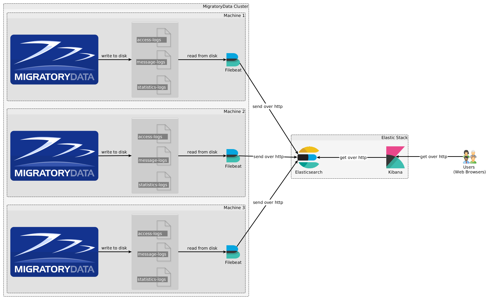

# Monitoring MigratoryData with Elastic Stack

This repository shows how to use Elastic Stack (Filebeat, Elasticsearch, and Kibana) for monitoring a MigratoryData cluster.

## Features

* Collecting and parsing MigratoryData logs (access logs, message logs, and statistics) by using Filebeat
* Indexing MigratoryData logs into Elasticsearch
* Building Kibana searches for analyzing data and dashboards for visualizing data

## Setup

For current purposes our setup consists in a MigratoryData cluster of three nodes. Each node runs one instance 
of MigratoryData Server and one instance of Filebeat. Filebeat is an agent which collects access logs, message logs and 
statistics logs produced by the MigratoryData server. The logs are collected on the fly, as soon as they are produced by 
the MigratoryData server. The collected logs are sent to the Elasticsearch server over the network.

Users use web browsers to visualize and analyze the data. Users connect to the Kibana server and make queries that are 
automatically forwarded to the Elasticsearch server. 



## Elasticsearch Installation and Configuration

You can start by installing one instance of Elasticsearch and one instance of Kibana on the **same machine**. Advanced 
Elastic Stack settings are available, including high availability clustering, but these are beyond the scope of this tutorial.

The installation of the Elasticsearch on Linux requires one kernel tuning. You can apply it temporarily by running the 
following command:

```
sudo sysctl -w vm.max_map_count=262144
```

Alternatively you can apply this kernel tuning permanently by editing the system configuration file `/etc/sysctl.conf` 
and adding the following line at the end of the file:

```
vm.max_map_count = 262144
```

and finally restart the Linux system.

Let us suppose that the IP address of the machine running Elasticsearch and Kibana is `192.168.1.1`.

The installation of Elasticsearch is straightforward. Download the installation package in zip or tar format and 
uncompress it. Edit the default configuration file `elasticsearch.yml` located under the folder `config` and configure 
the parameter `network.host` as follows:

```
network.host = 192.168.1.1
```

Finally, run the startup script `elasticsearch` located under the folder `bin`.

Elasticsearch will use the IP address `192.168.1.1` configured above and the default port `9200` to accept connections and
communicate with both the Filebeat agents and Kibana.

## Kibana Installation and Configuration

The installation of Kibana is straightforward. Simply download the installation package in zip or tar format and 
uncompress it. Edit the default configuration file `kibana.yml` located under the folder `config` and configure the
parameter `elasticsearch.url` as follows:

```
elasticsearch.url = 192.168.1.1:9200
```

Finally, run the startup script `kibana` located under the folder `bin`. 

Kibana will use the above configuration to connect to Elasticsearch and will use the default port `5601` to accept 
connections from users.

## Filebeat Installation and Configuration

One instance of the Filebeat agent should be installed on each machine of the MigratoryData cluster. The Filebeat agent 
collects the logs produced by the MigratoryData server into the folder defined by its parameter `LogFolder`, parse those 
logs, transform them into field-based messages as detailed below, and send them to Elasticsearch.

In order to install Filebeat, download the package in zip or tar format and uncompress it. Filebeat comes with a number 
of predefined modules available under the folder `module`. For example, there is a module for collecting the logs of 
apache2 or nginx. A module basically defines the rules for transforming a particular logging format into a field-based 
data message understood by Elasticsearch. The module based architecture of Filebeat allows the create of new modules.

We created a new module for Filebeat named `migratorydata`. It basically defines the rules for parsing the access logs,
message logs, and statistics logs of the MigratoryData server. In the future, we will enhance this module to parse more
logging information produced by the MigratoryData server. For example, Filebeat could collect Garbage Collection (GC) 
information such as the pause time introduced by the GCs.

In order to install the new module, copy the folder `migratorydata` available in this github repository under the folder
`elastic-stack/filebeat/module` into the folder `module` of your Filebeat installation.

The structure of the `migratorydata` module is as follows:

```
migratorydata
├── access
│   ├── config
│   │   └── access.yml
│   ├── ingest
│   │   └── pipeline.json
│   └── manifest.yml
├── message
│   ├── config
│   │   └── message.yml
│   ├── ingest
│   │   └── pipeline.json
│   └── manifest.yml
└── stats
    ├── config
    │   └── stats.yml
    ├── ingest
    │   └── pipeline.json
    └── manifest.yml
```

The module is structured into three similar sections corresponding to the three log types: access logs, message logs, and 
statistics. 

### Config Files

For example, the config file of the `access` section is similar to the one of the other two sections with 
the only exception that the field `document_type` defines the respective type of logs:

```
input_type: log
document_type: log-access
paths:
{{ range $i, $path := .paths }}
 - {{$path}}
{{ end }}
```

For the `message` and `stats` sections, `document-type` is `message-log` and `stats-logs`, respectively.

### Manifest Files

The `manifest` file of the sections differs only by the definition of the variable `paths` which points to the 
corresponding log file. For example, the `manifest` of the `access` section looks like:  

```
module_version: "1.0"

var:
  - name: paths
    default:
      - /var/log/migratorydata/all/access_*

ingest_pipeline: ingest/pipeline.json
prospector: config/access.yml
```

Similarly, the `manifest` of the `message` and `stats` sections will be similar excepting the `paths` pattern which is 
`message_*` and `pushserver_*`, respectively.

### Pipeline Files

Finally, the `pipeline` file defines the parsing rules of the logs. These rules are specific for each log type. 

#### Pipeline for Access Logs
 
The `pipeline` file of the `access` section defines the rule for parsing each user connect log into an
Elasticsearch message with the following fields:

```
   @timestamp
   migratorydata.access.time
   migratorydata.access.session_id
   migratorydata.access.client_ip
   migratorydata.access.operation
   migratorydata.access.user_agent
   migratorydata.access.session_type
   migratorydata.access.entitlement_token
   migratorydata.access.subjects
```

Also, it defines the rule for parsing each user disconnect log into an Elasticsearch message with the following fields:

```
   @timestamp
   migratorydata.access.time
   migratorydata.access.session_id
   migratorydata.access.client_ip
   migratorydata.access.operation
   migratorydata.access.disconnect_status
   migratorydata.access.subjects
```

#### Pipeline for Message Logs

The `pipeline` file of the `message` section defines the rule for parsing each MigratoryData message into an Elasticsearch
message with the following fields:

```
   @timestamp
   migratorydata.message.time
   migratorydata.message.subject
   migratorydata.message.content
   migratorydata.message.fields
   migratorydata.message.client_ip
   migratorydata.message.server_ip
   migratorydata.message.status
```

#### Pipeline for Statistics

The `pipeline` file of the `stats` section defines the rule for parsing the statistics written every 60 seconds 
(configurable with the parameter `StatisticsTimeInterval`) to the MigratoryData server's main log file into Elasticsearch
messages with the following fields:

```
   @timestamp
   migratorydata.stats.time
   migratorydata.stats.connected_sessions
   migratorydata.stats.connected_sessions_web
   migratorydata.stats.connected_sessions_mobile
   migratorydata.stats.connected_sessions_desktop
   migratorydata.stats.session_connections
   migratorydata.stats.session_disconnections
   migratorydata.stats.in_publish_msg
   migratorydata.stats.out_publish_msg
   migratorydata.stats.in_bytes
   migratorydata.stats.out_bytes
```

### Running Filebeat

At this stage, the `migratorydata` module has been installed into the folder `module` as detailed above. To run Filebeat
a configuration file `migratorydata.yml` should be created into the root of the Filebeat installation as follows:
 
```
output.elasticsearch:
    hosts: ["192.168.1.1:9200"]
    index: "migratorydata-log-%{+yyyy.MM.dd}"
```

This file is also available under this github repository. This file specifies the address of Elasticsearch as well as 
the name of the index used to group all the data received from Filebeat.

Finally, to run the Filebeat agent for the MigratoryData server of the cluster named say `server1` use the following command:

```
./filebeat -c migratorydata.yml -modules=migratorydata -E name=sever1 -e
```

Please note that the part `-E name=server1` is normally optional. If not provided, filebeat will use the hostname of the
machine running that instance of MigratoryData server. Using such assignation is particularly useful for testing when 
all servers of the MigratoryData cluster run on the same machine. Indeed, in order to be able to monitor each instance 
of the MigratoryData server of the cluster individually, each Filebeat monitor will add to each message that it sends to 
Elasticsearch a built-in field `beat.name` containing the value provided by the `name` variable above.

## Using Kibana

Kibana has been configured in the example above to lister for users on the IP address `192.168.1.1` and port `5601`. 
Therefore, in order to access Kibana use a modern web browser such as Google Chrome and open the following location:

```
http://192.168.1.1:5601
```

### Creating MigratoryData Index

The first time you access Kibana, it will ask you to create an index. An index is used to group together all related 
data. In this case, we will group all data collected by the Filebeat agents from the MigratoryData 
cluster under an index pattern `migratorydata-log-*`. Kibana will propose you a form as follows to create the index:


Once the index has been created, you can see it by navigating to `Management` -> `Index Patterns`.

### MigratoryData Searches

### MigratoryData Visualizations

### MigratoryData Dashboards

## Further Monitoring
 
### Garbage Collection Logs

### System Logs


